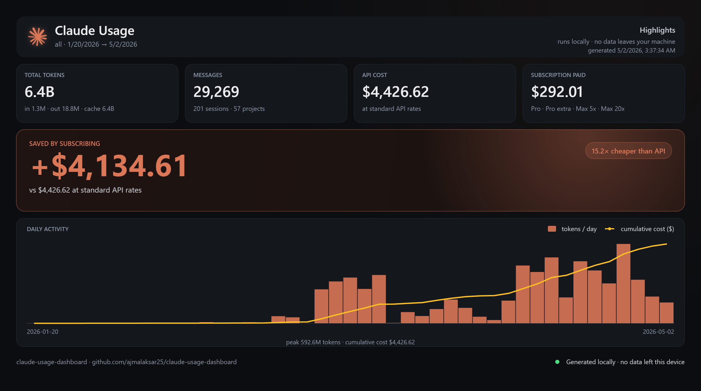
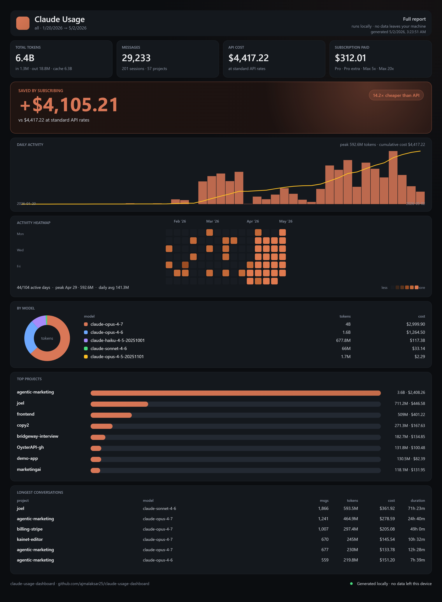

# Claude Usage Dashboard

> A local, one-command dashboard that tells you how much you've actually saved (or not) by using Claude's subscription tiers vs. paying API list prices for the same usage. Runs entirely on your machine — no data leaves your device.



## What it does

Reads your local Claude Code conversation history, tallies tokens and messages by model and project, prices the same usage at Claude's API list rates, and compares the result to what you've actually paid in subscriptions.

The output is two views:

- **Highlights** — total tokens, messages, sessions, projects, API-equivalent cost, subscription paid, the savings delta and multiplier, plus a daily activity bar chart.
- **Full report** — everything above, plus an activity heatmap, a model breakdown (donut + table), top projects, and a longest-conversations table.



## Quick start

```bash
git clone https://github.com/ajmalaksar25/claude-usage-dashboard.git
cd claude-usage-dashboard

# Windows
start.bat

# macOS / Linux
chmod +x start.sh && ./start.sh
```

The script creates a virtualenv, installs deps, parses your conversation history, and opens the dashboard at `http://127.0.0.1:8765`. Requires Python 3.10+.

First load takes about ten seconds while it parses your conversation history. Subsequent loads are near-instant — only files whose mtime changed are re-parsed.

The dashboard is intentionally middle-ground: not a CLI you have to grep your way through, not a click-and-go consumer app. If you can run a command in a terminal, you can run this.

## How it reads your data

- **Conversations** — read from Claude Code's local store (default location varies by OS; the dashboard auto-detects).
- **API-equivalent cost** — calculated against Claude's published per-model API rates (input, output, cache read, cache write).
- **Subscription paid** — two options:
  - *Manual:* copy `billing.json.example` to `billing.json` and add one entry per receipt (`{receipt_id, start, end, plan, amount_usd, source: "manual"}`).
  - *Gmail invoice extraction:* click **✉ Connect Gmail** in the top bar. It pulls Anthropic's invoice emails and sums them. Read-only, runs locally.

No data is sent anywhere. The Gmail integration runs against your local OAuth token, parses invoices in-process, and discards the rest. Revoke any time at [myaccount.google.com/permissions](https://myaccount.google.com/permissions).

If `billing.json` is missing or empty, the dashboard hides the "Subscription paid" and "Saved by subscribing" cards and just shows the API cost — your would-have-paid number.

---

## Want to rebuild this with Claude Code?

This README is also a build spec. If you'd rather not install — or you want to fork the idea, change the stack, or extend the calculations — drop this whole file into a Claude Code session and ask it to recreate the project. The spec below is intentionally framed by **behavior, not implementation**, so Claude Code can pick its own stack.

### Build spec

#### Goal

Build a local web dashboard that answers a single question: *"Is my Claude subscription actually saving me money compared to what I'd pay at API list prices for the same usage?"*

#### Inputs

- **Conversation history** — Claude Code's local conversation store. Auto-detect the path per OS (`~/.claude/...` on Unix-likes, `%APPDATA%\Claude\...` on Windows). Each conversation includes a model identifier, message-level token counts (input, output, cache read, cache write), timestamps, and a project identifier.
- **Subscription spend** — either:
  - User-entered tier(s) and effective date ranges, or
  - Gmail invoice extraction via OAuth (read-only). Filter for Anthropic invoice emails, parse amount and date, sum.
- **API rate table** — Claude's published per-model rates for input, output, cache read, cache write tokens. Hardcode current rates; allow override via config.

#### Required outputs

**Highlights view (compact, one-screen).**
1. Total tokens (with input/output/cache breakdown, e.g. `in 1.3M · out 18.8M · cache 6.4B`)
2. Messages count, with sessions and projects sub-counts
3. API cost at standard rates
4. Subscription paid (with tier history listed, e.g. `Pro · Pro extra · Max 5x · Max 20x`)
5. **Saved by subscribing** — primary visual, big number, with `Nx cheaper than API` badge
6. Daily activity chart — bars for tokens/day overlaid with a cumulative cost line
7. Header: date range, "runs locally · no data leaves your machine", generated-at timestamp

**Full report view (detailed, scrollable).**
1. Everything from Highlights
2. **Activity heatmap** — Mon/Wed/Fri rows × dates, intensity by token count. Show active-days fraction, peak day, daily average.
3. **By model** — donut chart of token share + table with model name, tokens, cost
4. **Top projects** — horizontal bar chart, ordered by tokens, with cost and token count per row
5. **Longest conversations** — table: project, model, message count, tokens, cost, duration
6. Footer: repo link, "Generated locally · no data left this device" indicator

#### Calculations

```
api_cost_per_message =
    input_tokens × model.input_rate
  + output_tokens × model.output_rate
  + cache_read_tokens × model.cache_read_rate
  + cache_write_tokens × model.cache_write_rate

api_cost_total = sum(api_cost_per_message for all messages)
saved          = api_cost_total − subscription_paid
multiplier     = api_cost_total / subscription_paid
```

#### Constraints

- Fully local. No outbound network calls except optional Gmail OAuth.
- One-command setup. Cloning, installing dependencies, parsing data, and serving the UI should all happen behind a single entry point.
- First load ≤ 10 seconds on a typical machine with a few months of history. Subsequent loads near-instant — cache parsed data and only re-parse changed conversations.
- Two clearly separated views (Highlights and Full report). The user should land on Highlights by default.

#### Stack hints (not prescriptive)

- **Backend:** any language with good local file access (Python and Node.js are both fine).
- **Frontend:** server-rendered HTML is fine; SPA is fine; whichever is faster to ship.
- **Charts:** any library that handles bar, donut, and heatmap. Chart.js, D3, or Recharts all work.
- **Persistence:** in-memory + a parsed-data cache file. No database needed.
- **Gmail:** Google's OAuth flow + Gmail API for invoice extraction. Skip if not requested.

#### Done criteria

- Run the one-command setup on a fresh checkout.
- Open the dashboard, see Highlights with real numbers from your local Claude Code history within 10 seconds.
- Switch to Full report, see the heatmap, model breakdown, top projects, and longest conversations populated correctly.
- Numbers reconcile: API cost matches a hand-calculation for one conversation; saved = API cost − subscription paid.

---

## Roadmap

- Multi-account support (currently parses one Claude account at a time)
- Per-project deep-dive view
- Export to JSON / CSV for further analysis
- Comparison mode for users on Cursor, Codex, or other AI coding tools
- Public/sharable summary card with PII stripped (for the inevitable Reddit thread)

## Feedback

If you run this and your numbers come out wildly different from mine, please [open an issue](https://github.com/ajmalaksar25/claude-usage-dashboard/issues) — that's the whole point. The dashboard is more useful as a debate-settler the more usage patterns it covers.

## License

[MIT](LICENSE).

## Author

[Ajmal Aksar](https://www.ajmalaksar.com) — backend dev who shipped this in two hours after a Reddit comment hit too close to home.
